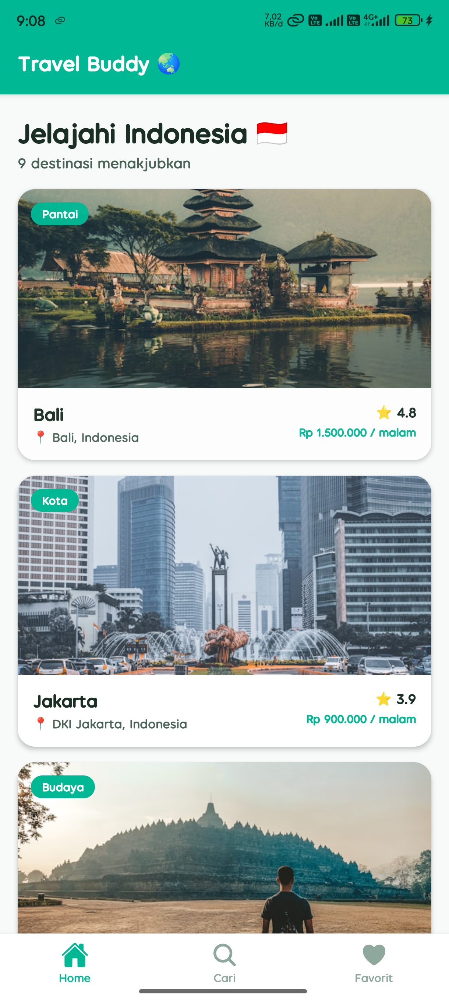
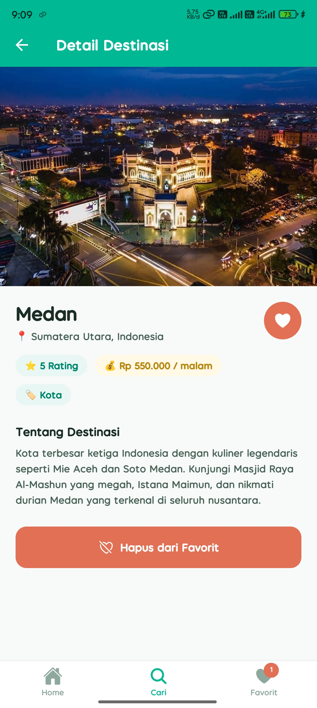
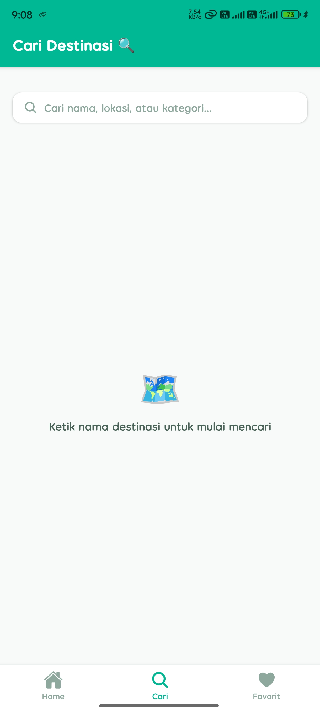
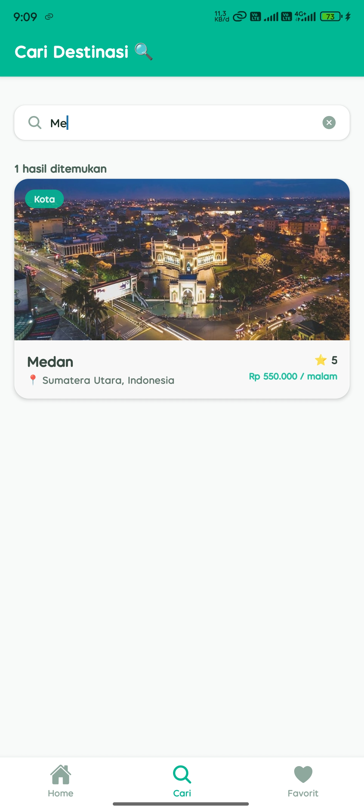
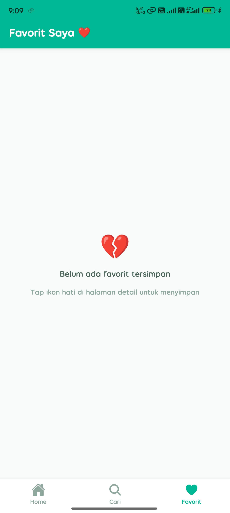
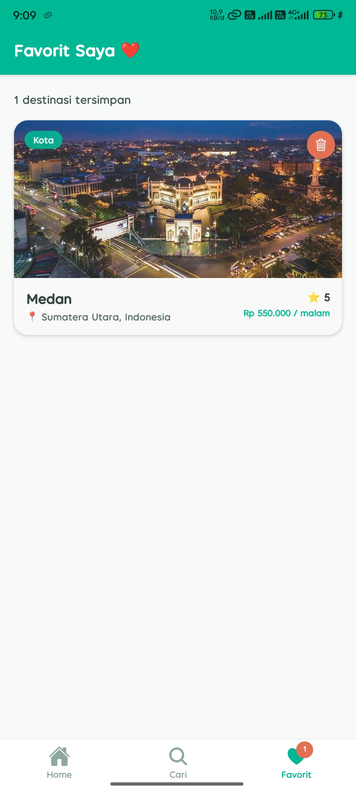

# Travel Buddy 🌏

Aplikasi multi-screen React Native untuk menjelajahi destinasi wisata Indonesia.

---

## Features

- **Bottom Tab Navigation** — 3 tab: Home, Cari, Favorit
- **Stack Navigator** di setiap tab (Home, Search, Favorites masing-masing punya stack sendiri)
- **FlatList** untuk menampilkan daftar 9 destinasi wisata
- **Route Params** — passing data destinasi dari HomeScreen ke DetailScreen
- **Add / Remove Favorites** — simpan destinasi favorit dengan React Context
- **Favorites Badge** — counter merah di tab icon saat ada favorit tersimpan
- **Search Filter** — filter destinasi real-time berdasarkan nama, lokasi, atau kategori
- **Local & Remote Images** — foto lokal (assets/) dan URL Unsplash
- **@expo/vector-icons** — Ionicons untuk tab icons (home, search, heart)
- **SafeAreaView** — layout aman di semua ukuran HP (notch & navigation bar)

---

## Tech Stack

- React Native + Expo
- React Navigation 6 (Stack + Bottom Tabs)
- React Context API (global favorites state)
- StyleSheet
- @expo/vector-icons (Ionicons)

---

## Project Structure

```
TravelBuddy/
├── App.js                    # Root: NavigationContainer + Tab Navigator
├── assets/
└── screens/
    ├── index.js              # Shared: THEME, destinations data, FavoritesContext, DestinationCard
    ├── HomeScreen.js         # FlatList daftar destinasi
    ├── DetailScreen.js       # Hero image, info lengkap, tombol favorit
    ├── SearchScreen.js       # Search bar + filter real-time
    ├── SearchResultScreen.js # Re-export DetailScreen (dipakai di SearchTab)
    └── FavoritesScreen.js    # Daftar favorit + tombol hapus
```

---

## How to Run

1. Clone repository ini
   ```bash
   git clone https://github.com/fariidd04/travel-buddy.git
   cd travel-buddy
   ```

2. Install dependencies
   ```bash
   npm install
   ```

3. Jalankan Expo
   ```bash
   npx expo start
   ```

4. Scan QR code di aplikasi **Expo Go** (Android / iOS)

---

## Screenshots

| Home Screen | Detail Screen |
|:-----------:|:-------------:|
|  |  |

| Search Screen | Search Result |
|:-------------:|:-------------:|
|  |  |

| Favorites Screen | Favorites Badge |
|:----------------:|:---------------:|
|  |  |


---

## Destinations

| # | Nama | Lokasi | Kategori | Rating |
|---|------|--------|----------|--------|
| 1 | Bali | Bali, Indonesia | Pantai | ⭐ 4.8 |
| 2 | Jakarta | DKI Jakarta, Indonesia | Kota | ⭐ 3.9 |
| 3 | Yogyakarta | DIY Yogyakarta, Indonesia | Budaya | ⭐ 4.7 |
| 4 | Lombok | NTB, Indonesia | Pantai | ⭐ 4.6 |
| 5 | Raja Ampat | Papua Barat, Indonesia | Alam | ⭐ 4.9 |
| 6 | Labuan Bajo | NTT, Indonesia | Alam | ⭐ 4.7 |
| 7 | Bromo | Jawa Timur, Indonesia | Petualangan | ⭐ 4.5 |
| 8 | Manado | Sulawesi Utara, Indonesia | Pantai | ⭐ 4.4 |
| 9 | Medan | Sumatera Utara, Indonesia | Kota | ⭐ 5.0 |

---

## Author

**[Muhammad Faried Permana]**  

---

## 🔗 Live Demo

- [Expo Snack](https://snack.expo.dev/@fariid.dd/travel-buddy)

---